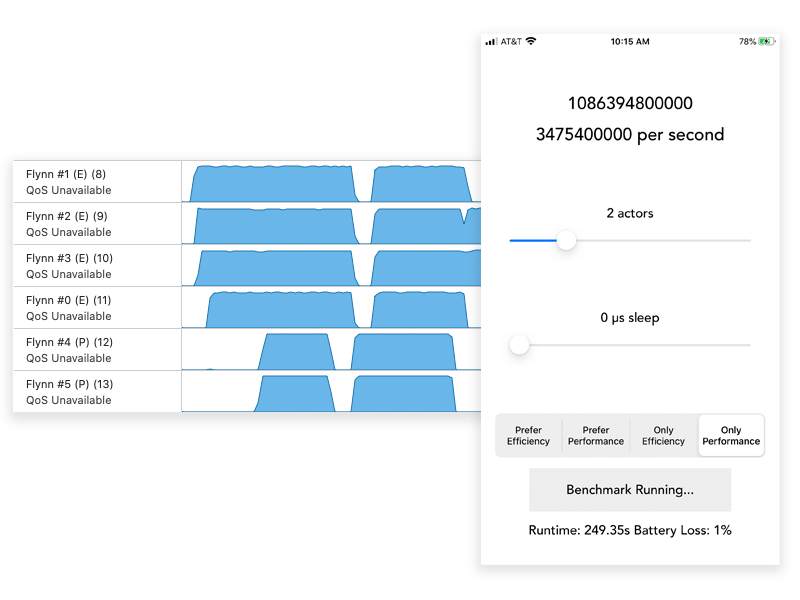

## BatteryTester

This example uses actors to perform continuous busy work in order to demonstrate the core affinity feature.

Any actor in Flynn can be assigned a core affinity by doing:

```actor.unsafeCoreAffinity = .preferEfficiency```

For complete details, please see the [Actor Scheduling](../docs/SCHEDULING.md) documentation.



