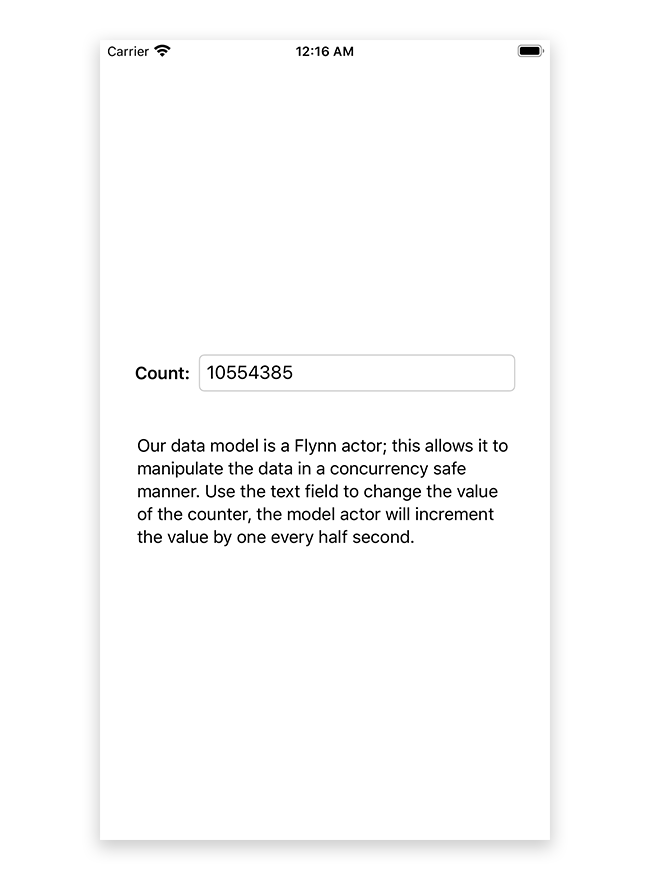

## Actor with SwiftUI

This example displays data from an Actor using SwiftUI.

In a nutshell, ConcurrentData is a Flynn Actor with a single count Int value as data.  It does the following:

1. Ensures concurrency safety for the data
2. Exposes the data to SwiftUI for both getting and setting
3. Calls objectWillChange.send() on the main thread when the data changes
4. Serializes and deserializes the data when the app is backgrounded/foregrounded
5. Uses a Flynn.Timer to increment the data twice a second, simulating the data changing concurrently
6. The user can edit the field at any time, also causing the data to change while its changing due to the timer

