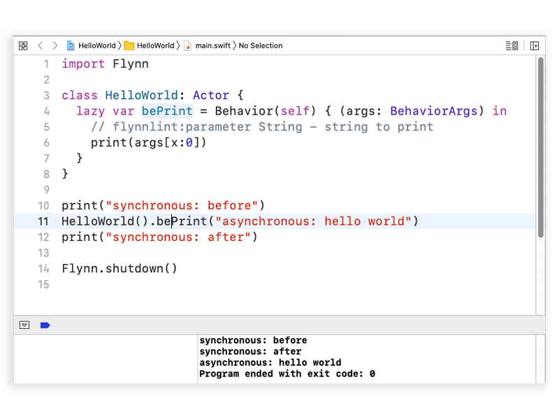

## HelloWorld

Behavior calls on actors are concurrent, so this minimal example shows how calling bePrint() on the HelloWorld actor is executed asynchronously with respect to the calling code.

```Flynn.shutdown()``` will cause the current thread to wait until all actors have finished processing and the Flynn scheduling system has ended.  In our example, without this then hello world would not be printed as the program would exit prior to bePrint() running.





