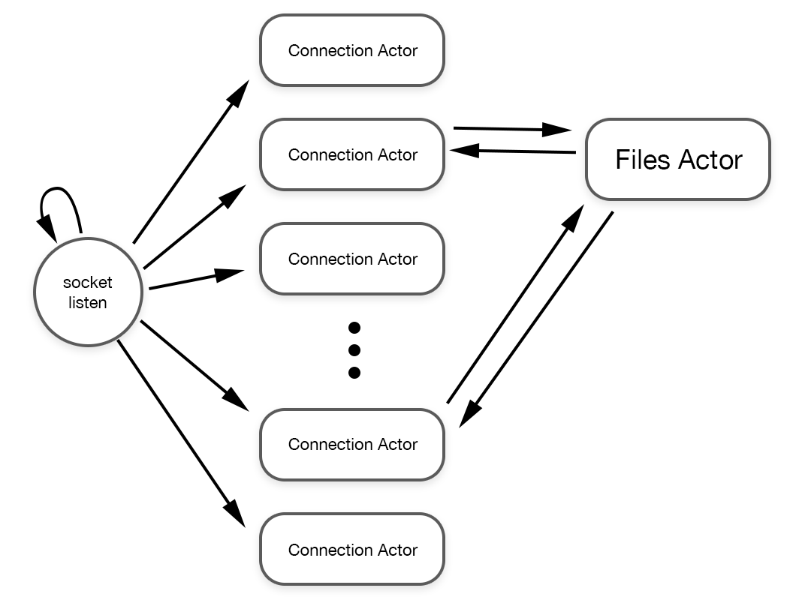

## SimpleHttpServer

A common use case for Actor-Model programming is server-side applications, where high levels of concurrency and low latency communication between actors can be utilized well. This example creates a (very simple) HTTP server, and then provides some benchmarks (for reference only) and describes some of the architectural decisions of the example.

### Actor Architecture



We're utilizing [BlueSocket](https://github.com/IBM-Swift/BlueSocket) as our socket-level interface.  The main thread of the tool listens on a socket and then hard loops accepting connections on said socket.  For each connection that is made a Connection actor is spawned to handle that connection session.

Connection actors "recursively" call the ```beNextCommand()``` behavior. We put recursively in quotes because its a behavior, which implies an inherent concurrency which makes it not like normal recursion.  Think of it instead as a "perform after delay".

```beNextCommand()``` calls socket.read() with a 25ms timeout. If data is read from the socket, then the request is parsed and handled. After the request is handled, beNextCommand() is called again to check for the next HTTP request.  This mechanism has some interesting implications to latency and throughput, which are covered in said section below.

As an exercise, we added a Files actor to coordinate access to the file system for GET requests. Instead of allowing Connections to perform disk I/O themselves, they ask the Files actor to retrieve the files for them. This example portrays protected access to a shared resource (in our case, the file system).  In reality, whether you want to consider the file system a protected or contested resource is your call.

### Reference Benchmarks

| Test Server        |  Requests/sec  | Avg Latency  | Avg CPU |
|--------------------|----------------|--------------|---------|
|  SimpleHttpServer  |  110,103.87    | 1.02ms       | 200%    |
|  Crystal           |  92,657.10     | 1.08ms       | 200%    |
|  Vapor             |  60,981.02     | 1.63ms       | 750%    |
|  Node              |  63,496.17     | 1.57ms       | 110%    |
|  Hyper             |  56,224.21     | 1.47ms       | 800%    |

To understand how our little http server example does compared to existing solutions, while writing this example we utilized a very simple benchmark on [Node](https://nodejs.org/en/), [Cystal](https://crystal-lang.org), [Vapor](https://crystal-lang.org) and [Hyper](https://hyper.rs); using a methodology similar [to this benchmark outlined here](https://github.com/costajob/app-servers#results). The benchmark was run on the same machine (28 cores, 64 BG RAM, macOS Catalina 10.15.4) under similar conditions. Each server was coded to response to the "hello world" with a simple "hello world" plain text response. Each was benched using the following command:

```
wrk -t 4 -c 100 -d30s --timeout 2000 http://127.0.0.1:8080/hello/world
```

To reiterate these benchamrks are here for reference only! As our little http server example is not a full server, its an apples-to-oranges comparison. However, they do imply that our little example is probably getting some things right.


### Latency vs Throughput

As mentioned above, our connection actors "recursively" call beNextCommand(). In the Flynn runtime, each behavior call is a message which is placed in an actor's message queue, to be executed in sequence when the actor is run by a scheduler.

When an actor is run by a scheduler, it will process at most "one batch" worth of messages. At the time of this writing, the default batch size is 1000 messages. When we call a behavior recursively, that behavior is added to the queue immediately, and the actor will continue to execute and utilize the scheduler while doing so.  If we leave the batch size at 1000, we will see similar level of throughput but a much higher average latency. This is because some connections are being super-served, while others are being starved of scheduler time.

All actors are not created equal and Flynn acknowledges this fact by providing you ample per actor overrides.  In this case, we settled on ```self.unsafeMessageBatchSize = 2```.  This allows a Connection actor to process, at most, 2 behaviors in a row before it yields to another actor. Setting this value to "1" provides the most consistent latency, but overly hinders throughput.  A value of "2" seems to provide the best of both worlds, and as such is what we went with.

