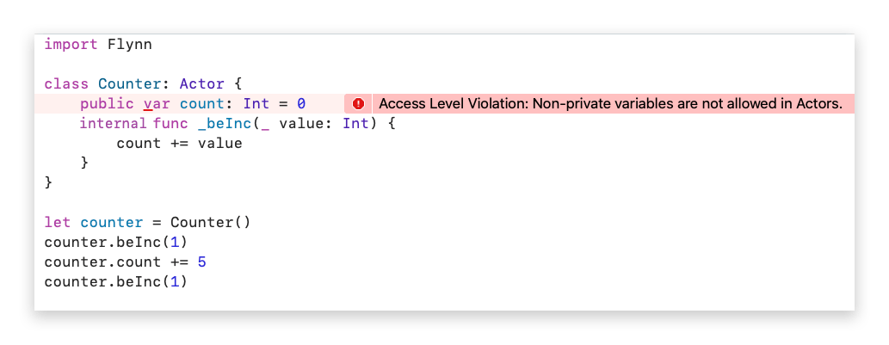

Swift added its own [Swift Concurrency Model](https://docs.swift.org/swift-book/LanguageGuide/Concurrency.html) in Swift 5.5. If you are unfamiliar with it, you should likely go read up on it first. If you are still interested in learning Flynn after that, please continue :)

## Quick Start

### Swift Package Manager

To use Flynn make sure you are using **Swift 5.6** or later and make the following changes to your Package.swift

Add to your Package:

```swift
dependencies: [
    .package(url: "https://github.com/KittyMac/Flynn.git", from: "0.3.0"),
]
```

Add to the desired Target:

```swift
.target(
	...
	dependencies: [
		"Flynn"
	],
	plugins: [
		.plugin(name: "FlynnPlugin", package: "Flynn")
	]
)
```

### Actor-Model Programming

Flynn grafts Actor-Model programming onto Swift, providing safety and performance for your highly concurrent Swift code.  Flynn is heavily inspired by the [Pony programming language](https://www.ponylang.io). Here's what you need to know:

#### [Actors are concurrency safe Swift classes](docs/ACTOR.md)

Using Actors to separate concurrent logic provides safety, performance, and efficiency.

```swift
class ConcurrentDatastore: Actor {
  // Everything inside this actor is safe and cannot
  // be accessed concurrently by any other thread
  private var storage: [String: String] = [:]
  
  ...
}
```

#### [Behaviors are asynchronous method calls](docs/BEHAVIOR.md)

Actors provide behaviors (which look like normal method calls at the call site) that execute asynchronously from the caller's perspective.

```swift
let datastore = ConcurrentDatastore()
datastore.beStore("SomeKey", "SomeValue")
```

From the Actor's perspective, behaviors execute synchronously (in the same order they are sent for the calling code).

```swift
class ConcurrentDatastore: Actor {
  ...
  // Behaviors are called asynchronously but execute synchronously on the Actor
  internal func _beStore(_ key: String, _ value: String) {
    storage[key] = value
  }
}
```

#### [Actors run on schedulers](docs/SCHEDULER.md)

Unlike other attempts to bring Actor-Model programming to Swift, Flynn does not use DispatchQueues. Instead, Flynn includes a modified version of the [Pony language runtime](https://www.ponylang.io/faq/#runtime). This makes actors in Flynn much more light-weight than DispatchQueues; you can have millions of actors all sending messages to each other incredibly efficiently.

#### Concurrency warnings and errors at compile time

The Flynn library provides the mechanisms for safer concurrency and the FlynnPlugin will help ensure that safety for you at compile time. This keeps you out of numerous concurrency pitfalls by not allowing unsafe code to compile:



In this example, we have a public variable on our Counter Actor. Public variables are not allowed as they can be potentially accessed from other threads, breaking the concurrency safety the Actor-Model paradigm provides us.

#### [Remote actors are actors which run elsewhere](docs/FLYNNPLUGIN.md)

RemoteActors are an advanced topic and are likely useful only to a subset of developers.  

As of v0.2 Flynn has a new kind of actor, the ```RemoteActor```.  RemoteActors behave similarly to Actors; they have internal state which is concurrency safe and you interact with them by calling behaviors. RemoteActors are intended to execute outside of your normal Flynn environment, usually that's in another process running on an different machine.  Since RemoteActors run elsewhere, they are more restrictive then normal Actors (for instance, you cannot choose to unsafely expose access RemoteActors).  Please see the RemoteActor documentation for more details.

## Docs

[Actors](docs/ACTOR.md) - Concurrency safe Swift classes  
[Behaviors](docs/BEHAVIOR.md) - Asynchronous method calls  
[Scheduling](docs/SCHEDULER.md) - How and when Actors execute Behaviors  
[FlynnPlugin](docs/FLYNNPLUGIN.md) - Protects against data races and other bad things  
[Flowable Actors](docs/FLOWABLE.md) - Easily chainable networks of actors  
[Flynn.Timer](docs/TIMERS.md) - Actor friendly Timers  
[RemoteActors](docs/REMOTEACTOR.md) - Run actors in another process  

[Coexisting with Swift Concurrecy](docs/SWIFTCONCURRENCY.md) - Coexisting peacefully with async/await  

## Examples

[Hello World](Examples/HelloWorld/) - You guessed it!  
[Battery Tester](Examples/BatteryTester/) - Use an Actor's core affinity to make smart choices between performance and energy consumption  
[Simple HTTP Server](Examples/SimpleHTTPServer/) - Actors for HTTP connections, Actors as services  
[Concurrent Data SwiftUI](Examples/ConcurrentDataSwiftUI/) - Simple example of using Actor as ObservableObject for SwiftUI  
[Actor Callbacks](Examples/ActorCallbacks/) - Two scenarios for how to call back to an actor

## Projects
[Jukebox](https://github.com/KittyMac/jukebox2) - Linux daemon for running a homebrewed Alexa powered Jukebox  
[Cutlass](https://github.com/KittyMac/cutlass) - Fully concurrent user interfaces using Flynn, [Yoga](https://yogalayout.com) and [Metal](https://developer.apple.com/metal/)  

## Products
<a href="https://apps.apple.com/us/app/pointsman/id1447780441" target="_blank"></a>
<a href="https://apps.apple.com/us/app/mad-kings-steward/id1461873703" target="_blank"></a>

Have you released something using Flynn? Let us know!

## License

Flynn is free software distributed under the terms of the MIT license, reproduced below. Flynn may be used for any purpose, including commercial purposes, at absolutely no cost. No paperwork, no royalties, no GNU-like "copyleft" restrictions. Just download and enjoy.

Copyright (c) 2020 [Chimera Software, LLC](http://www.chimerasw.com)

Permission is hereby granted, free of charge, to any person obtaining a copy of this software and associated documentation files (the "Software"), to deal in the Software without restriction, including without limitation the rights to use, copy, modify, merge, publish, distribute, sublicense, and/or sell copies of the Software, and to permit persons to whom the Software is furnished to do so, subject to the following conditions:

The above copyright notice and this permission notice shall be included in all copies or substantial portions of the Software.

THE SOFTWARE IS PROVIDED "AS IS", WITHOUT WARRANTY OF ANY KIND, EXPRESS OR IMPLIED, INCLUDING BUT NOT LIMITED TO THE WARRANTIES OF MERCHANTABILITY, FITNESS FOR A PARTICULAR PURPOSE AND NONINFRINGEMENT. IN NO EVENT SHALL THE AUTHORS OR COPYRIGHT HOLDERS BE LIABLE FOR ANY CLAIM, DAMAGES OR OTHER LIABILITY, WHETHER IN AN ACTION OF CONTRACT, TORT OR OTHERWISE, ARISING FROM, OUT OF OR IN CONNECTION WITH THE SOFTWARE OR THE USE OR OTHER DEALINGS IN THE SOFTWARE.
