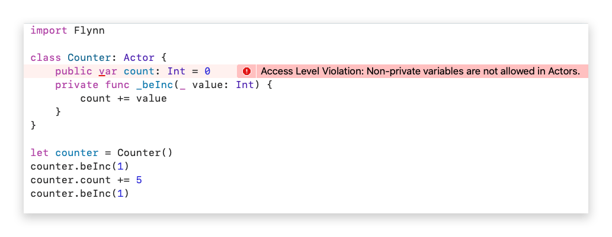
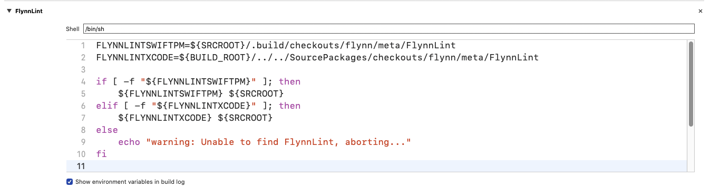

# Flynn


Write **fast**, **safe**, **efficient**, highly concurrent Swift with **Flynn**.

```swift
import Flynn

class HelloWorld: Actor {
    lazy var bePrint = ChainableBehavior(self) { (args: BehaviorArgs) in
        // flynnlint:parameter String - string to print
        print(args[x:0], terminator: "")
    }
}

HelloWorld().bePrint("hello").bePrint(" ").bePrint("world!\n")
```

&nbsp;  
&nbsp;  
&nbsp;  
&nbsp;  


## Quick Start

### Actor-Model Programming

Flynn grafts Actor-Model programming onto Swift, providing a new level of safety and performance to your Swift code.  Here's what you need to know:

#### Actors are concurrency safe Swift classes

An Actor is a protected entity for concurrent computation. Outside code can only interact with the actor by sending it messages (called **behaviors**). Actor behaviors are processed sequentially, removing any concurrency concerns inside of the actor. All state associated with actor should be kept private to that actor.

#### Behaviors are asynchronous method calls

Calling a behavior on an actor will always execute asynchronously from the perspective of the caller. Behaviors will also only execute synchronously from the perspect of the callee. If you follow the Flynn best practices (enforced by FlynnLint), your behaviors will start with "be", making it trivial to know which methods are behaviors and thus asynchronous.

#### Actors run cooperatively

Using Flynn you can easily have millions of actors, all executing concurrently in their safe, synchronous walled enviroments. To accomplish this, Flynn creates a scheduler thread per physical CPU core available on the host device. Actors which have work to do (ie behavior calls to process) will be scheduled and run on the scheduler threads. While an actors is running, no other actor can run on that scheduler until it completes. As such, if you are running on a 6-core A12 CPU, then you will only ever have up to six actors running in parallel at one time. As such, you should avoid **blocking operations** in actors.

#### Use FlynnLint

Flynn provides the scaffolding for safe concurrency programming; FlynnLint enforces it. For example, for an Actor to be data race free all of its functions and member variables should be private and inaccessible to outside code. Flynn can't stop you from making public functions. FlynnLint can.

Example of a common mistake using Flynn without FlynnLint:

```swift
import Flynn

// NOTE: THIS IS AN UNSAFE EXAMPLE OF FLYNN (FLYNNLINT WILL PROTECT AGAINST THIS)
class Counter: Actor {
    public var count: Int = 0
    lazy var beInc = ChainableBehavior(self) { (_: BehaviorArgs) in
        self.count += 1
    }
}

let counter = Counter()
for _ in 0..<1000000 {
    counter.beInc()
    counter.count += 1
}

// prints 1994681, which is incorrect as we have a data race on count
// since it is accessed by two threads at the same time (this thread
// and the scheduler thread running the actor's beInc() calls
print("count: \(counter.count)")

Flynn.shutdown()
```

FlynnLint will protect you from this and numerous other pitfalls by not allowing unsafe code to compile:




## Installation

Flynn is a fully compatible with the Swift Package Manager.

### Swift Package Manager

If you use swiftpm, you can add Flynn as a dependency directly to your Package.swift file.

```
dependencies: [
    .package(url: "https://github.com/KittyMac/Flynn.git", .upToNextMinor(from: "0.0.1")),
],
```

### XCode

To integrate with Xcode, simply add it as a package dependency by going to

```
File -> Swift Packages -> Add Package Dependency
```

and pasting the url to this repository. Follow the instructions to complete the dependency addition.  [Check the releases page](https://github.com/KittyMac/flynn/releases) for release versions or choose master branch for the bleeding edge.

Flynn is most effective when used with FlynnLint. FlynnLint helps protect you from accidentally introducing data races in your highly concurrent code by enforcing Flynn's best programming practices.  

#### It is HIGHLY RECOMMENDED that you use FlynnLint!

FlynnLint is included in the Flynn repository in the meta folder. Just add a new "Run Script Phase" with:

```bash
FLYNNLINTSWIFTPM=${SRCROOT}/.build/checkouts/flynn/meta/FlynnLint
FLYNNLINTXCODE=${BUILD_ROOT}/../../SourcePackages/checkouts/flynn/meta/FlynnLint

if [ -f "${FLYNNLINTSWIFTPM}" ]; then
    ${FLYNNLINTSWIFTPM} ${SRCROOT}
elif [ -f "${FLYNNLINTXCODE}" ]; then
    ${FLYNNLINTXCODE} ${SRCROOT}
else
    echo "warning: Unable to find FlynnLint, aborting..."
fi
```



If you use other linters (such as SwiftLint), it is recommended that FlynnLint runs before all other linters.

FlynnLint processes any and all directories provided as arguments. If you want to restrict it to a subset of directories, simply list each directory after the call to FlynnLint. For example, if you use swiftpm and your source files are in /Sources and /Tests, then the following would lint just those directories:

```bash
FLYNNLINTSWIFTPM=${SRCROOT}/.build/checkouts/flynn/meta/FlynnLint
FLYNNLINTXCODE=${BUILD_ROOT}/../../SourcePackages/checkouts/flynn/meta/FlynnLint

if [ -f "${FLYNNLINTSWIFTPM}" ]; then
    ${FLYNNLINTSWIFTPM} ${SRCROOT}/Sources ${SRCROOT}/Tests
elif [ -f "${FLYNNLINTXCODE}" ]; then
    ${FLYNNLINTXCODE} ${SRCROOT}/Sources ${SRCROOT}/Tests
else
    echo "warning: Unable to find FlynnLint, aborting..."
fi
```

## License

Flynn is free software distributed under the terms of the MIT license, reproduced below. Flynn may be used for any purpose, including commercial purposes, at absolutely no cost. No paperwork, no royalties, no GNU-like "copyleft" restrictions. Just download and enjoy.

Copyright (c) 2020 [Chimera Software, LLC](http://www.chimerasw.com)

Permission is hereby granted, free of charge, to any person obtaining a copy of this software and associated documentation files (the "Software"), to deal in the Software without restriction, including without limitation the rights to use, copy, modify, merge, publish, distribute, sublicense, and/or sell copies of the Software, and to permit persons to whom the Software is furnished to do so, subject to the following conditions:

The above copyright notice and this permission notice shall be included in all copies or substantial portions of the Software.

THE SOFTWARE IS PROVIDED "AS IS", WITHOUT WARRANTY OF ANY KIND, EXPRESS OR IMPLIED, INCLUDING BUT NOT LIMITED TO THE WARRANTIES OF MERCHANTABILITY, FITNESS FOR A PARTICULAR PURPOSE AND NONINFRINGEMENT. IN NO EVENT SHALL THE AUTHORS OR COPYRIGHT HOLDERS BE LIABLE FOR ANY CLAIM, DAMAGES OR OTHER LIABILITY, WHETHER IN AN ACTION OF CONTRACT, TORT OR OTHERWISE, ARISING FROM, OUT OF OR IN CONNECTION WITH THE SOFTWARE OR THE USE OR OTHER DEALINGS IN THE SOFTWARE.