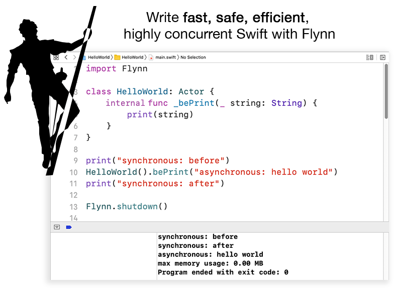

&nbsp;  

## Examples

[Hello World](Examples/HelloWorld/) - You guessed it!  
[Battery Tester](Examples/BatteryTester/) - Use an Actor's core affinity to make smart choices between performance and energy consumption  
[Cutlass](https://github.com/KittyMac/cutlass) - Fully concurrent user interfaces using Flynn, [Yoga](https://github.com/facebook/yoga) and [Metal](https://developer.apple.com/metal/)


## Quick Start

### Actor-Model Programming

Flynn grafts Actor-Model programming onto Swift, providing a new level of safety and performance for your highly concurrent Swift code.  Here's what you need to know:

#### [Actors are concurrency safe Swift classes](docs/ACTOR.md)

Using Actors to separate concurrent logic provides safety, performance, and efficiency.

```swift
class ConcurrentDatastore: Actor {
  // Everything inside this actor is safe and cannot
  // be accessed concurrently by any other thread
  private var storage: [String: String] = [:]
  
  ...
}
```

#### [Behaviors are asynchronous method calls](docs/BEHAVIOR.md)

Actors provide behaviors (which look like normal method calls at the call site) that execute asynchronously from the caller's perspective.

```swift
let datastore = ConcurrentDatastore()
datastore.beStore("SomeKey", "SomeValue")
```

From the Actor's perspective, behaviors execute synchronously (in the same order they are sent for the calling code).

```swift
class ConcurrentDatastore: Actor {
  ...
  // Behaviors are called asynchronously but execute synchronously on the Actor
  lazy var beStore = ChainableBehavior(self) { [unowned self] (args: BehaviorArgs) in
    // flynnlint:parameter String - key
    // flynnlint:parameter String - value
    self.storage[args[x:0]] = args[x:1]
  }
}
```

#### [Actors run on schedulers](docs/SCHEDULER.md)

Unlike other attempts to bring Actor-Model programming to Swift, Flynn does not rely on the "DispatchQueue per Actor" mechanism. This makes actors in Flynn much more light-weight; you can have millions of actors.  This is accomplished by Flynn's actor scheduling system. Follow the link above to learn more.

#### [Use FlynnLint](docs/FLYNNLINT.md)

Flynn provides the scaffolding for safer concurrency, but FlynnLint enforces it.  FlynnLint will protect you from numerous concurrency pitfalls by not allowing unsafe code to compile:


## Installation

Flynn is a fully compatible with the Swift Package Manager.

### Swift Package Manager

If you use swiftpm, you can add Flynn as a dependency directly to your Package.swift file.

```
dependencies: [
    .package(url: "https://github.com/KittyMac/Flynn.git", .upToNextMinor(from: "0.0.1")),
],
```

### Xcode

To integrate with Xcode, simply add it as a package dependency by going to

```
File -> Swift Packages -> Add Package Dependency
```

and pasting the url to this repository. Follow the instructions to complete the dependency addition.  [Check the releases page](https://github.com/KittyMac/flynn/releases) for release versions or choose master branch for the bleeding edge.

Flynn is most effective when used with FlynnLint. FlynnLint helps protect you from accidentally introducing data races in your highly concurrent code by enforcing Flynn's best programming practices.  

#### It is HIGHLY RECOMMENDED that you use FlynnLint!

FlynnLint is included in the Flynn repository in the meta folder. Just add a new "Run Script Phase" with:

```bash
FLYNNLINTSWIFTPM=${SRCROOT}/.build/checkouts/flynn/meta/FlynnLint
FLYNNLINTXCODE=${BUILD_ROOT}/../../SourcePackages/checkouts/flynn/meta/FlynnLint

if [ -f "${FLYNNLINTSWIFTPM}" ]; then
    ${FLYNNLINTSWIFTPM} ${SRCROOT}
elif [ -f "${FLYNNLINTXCODE}" ]; then
    ${FLYNNLINTXCODE} ${SRCROOT}
else
    echo "warning: Unable to find FlynnLint, aborting..."
fi
```


If you use other linters (such as SwiftLint), it is recommended that FlynnLint runs before all other linters.

FlynnLint processes any and all directories provided as arguments. If you want to restrict it to a subset of directories, simply list each directory after the call to FlynnLint. For example, if you use swiftpm and your source files are in /Sources and /Tests, then the following would lint just those directories:

```bash
${FLYNNLINTSWIFTPM} ${SRCROOT}/Sources ${SRCROOT}/Tests
```

## License

Flynn is free software distributed under the terms of the MIT license, reproduced below. Flynn may be used for any purpose, including commercial purposes, at absolutely no cost. No paperwork, no royalties, no GNU-like "copyleft" restrictions. Just download and enjoy.

Copyright (c) 2020 [Chimera Software, LLC](http://www.chimerasw.com)

Permission is hereby granted, free of charge, to any person obtaining a copy of this software and associated documentation files (the "Software"), to deal in the Software without restriction, including without limitation the rights to use, copy, modify, merge, publish, distribute, sublicense, and/or sell copies of the Software, and to permit persons to whom the Software is furnished to do so, subject to the following conditions:

The above copyright notice and this permission notice shall be included in all copies or substantial portions of the Software.

THE SOFTWARE IS PROVIDED "AS IS", WITHOUT WARRANTY OF ANY KIND, EXPRESS OR IMPLIED, INCLUDING BUT NOT LIMITED TO THE WARRANTIES OF MERCHANTABILITY, FITNESS FOR A PARTICULAR PURPOSE AND NONINFRINGEMENT. IN NO EVENT SHALL THE AUTHORS OR COPYRIGHT HOLDERS BE LIABLE FOR ANY CLAIM, DAMAGES OR OTHER LIABILITY, WHETHER IN AN ACTION OF CONTRACT, TORT OR OTHERWISE, ARISING FROM, OUT OF OR IN CONNECTION WITH THE SOFTWARE OR THE USE OR OTHER DEALINGS IN THE SOFTWARE.