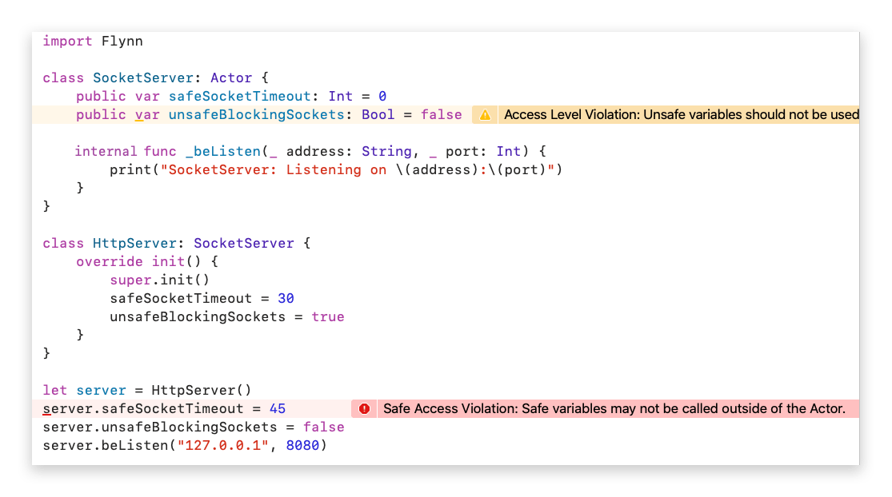

# Actors

Think of actors as concurrency safe Swift classes. This safety is accomplished by restricting all communications with the actor to behavior calls only; all other members and functions on the actor should be set to private.  Behavior calls are units of execution which will be processed sequentially by the actor, but concurrently to other actors. Since all functions are private and all behavior code is safely executed, all code inside of the actor is then thread safe.

This is the ideal. Unfortunately, to be 100% thread safe through access restrictions we would need to modify Swift itself, in order to prevent pass-by-reference values from being shared between actors.  Since we are not in a position to do that, we instead have a set of best practices which get you as close to 100% thread safe as is possible.

## Actor Best Practices

**Restrict access to variables and functions by making them private**  
*No random thread can read or write your variables or execute your code on their thread through direct access*

**Use behaviors for all interactions with actors**  
*Behaviors ensure code is executed safely and concurrently on your actor*

**Send pass-by-value arguments to behaviors**  
*Pass-by-value types are safe to share between threads and should be preferred use sending data to actors. Pass-by-reference values can be used, of course, but you need to ensure that no two actors access the same pass-by-referenced value.*

**Beware of closures and actors**  
*Many APIs execute closures as callbacks; if those are executed on a different thread, then two threads are accessing the innards of an actor at the same time (which would be bad). Closure callbacks should immediately call behaviors, keeping everything thread safe*

These may seem like a lot! Flynnlint will ensure you comply with these best practices at compile time. So if you forget to label an Actor variable as private, it will flag that as an error.

## Flynnlint Enforces Actor Best Practices

Flynnlint ensures that your actor code adheres to the best practices.  For actors specifically, that means ensuring that:

**All actor variables are private**  
*Covered above*

**All actor functions are private**  
*Covered above*

**Actor variables and functions that start with "safe" are "protected"**  
*If all variables and functions in a actor must be private, then class inheritance would be near impossible to do effectively. As such, Flynnlint provides its own implementation pf "protected" access for Actors. Simply start your variable or function with the prefix "safe" and Flynnlint will allow you to make it non-private.  Once it is non-private, it can be called by outside of the main Actor class. Flynnlint will then ensure that the safe variable is only called from a subclass of that actor class, effectively giving actors a "protected" access level*

**Actor variables and functions that start with "unsafe" are... unsafe!**  
*At the end of the day, you are the developer. If you want to expose access to a variable or function on a actor to be potentially called directly by other threads you can do this by using the prefix "unsafe". As the name implies, all Flynnlint protections are turned off for unsafe variables and functions, and it is up to you to provide any necessary measure so that these can be used safely*



## Actor Priority

Actors execute cooperatively on schedulers; there is one scheduler per CPU core. For some actor configurations, it may be beneficial to give an actor higher or lower priority to than other actors. For example, if you have a pool of producer actors feeding a single consumer actor, you might want to give the consumer actor a higher priority to ensure it receives preferencial scheduling compared to the producers.


## Actor Core Affinity

Some CPUs support different cores for different purposes. For example, on Apple Silicon there are performance (P) cores and efficiency (E) cores. Each scheduler in Flynn is also labelled as either a performance or an efficiency scheduler. An actor can set its core affinity preference to hint how it should be scheduled. If you want to maximize battery life on an iOS device, for example, you can set your actors to only run on the efficiency cores. Or, in our example of many producers to a single consumer, each producer could be set to efficiency cores while the consumer is set to a high performance core.

```swift
class CriticalService: Actor {
    override init() {
        super.init()
        unsafeCoreAffinity = .onlyPerformance
        unsafePriority = 99
    }
}
```

## Actor Yielding

When an actor is run on a scheduler it will execute one "batch" of messages from its message queue. In some scenarios, you might want the actor to execute less than the entire batch of messages, instead yielding execution after the current behavior call ends. You can do this by calling ```unsafeYield()``` on the actor.

## Actor Message Count

There are situations when knowing how much work (waiting messages) an actor has can be beneficial. For example, imagine an actor network which reads in chunks of data from a big data stream and passes them through a chain of actors to transform and/or process the data. If the producers can introduce data faster than the consuming actors can process it, then the messages will sit in the consumer message queues bloating memory until they can get processed.

Note: Unlike other Actor-Model runtimes, Flynn does not have a built-in back pressure system. This is intentional, as we believe it is better to put the power in your hands to architect your actor networks properly.  Using message counts and yielding to slow down producers to not overload consumers is one mechanism you can use to handle this.

```swift
class Producer: Actor {
    private let consumer = Consumer()
    
    private func _beProduce() {
        // Don't overload the consumer; check that they have a small enough
        // message queue. If they don't then we explicitly yield execution
        // (allowing other actors to use this scheduler) and we try again
        // in the future.
        if consumer.unsafeMessagesCount < 10 {
            consumer.beConsume("some data")
        } else {
            unsafeYield()
        }
    }
}
```

## Blocking on Actors

Similar to the scenario above where a produce is delaying producing items in order to not overwhelm a consumer, it is also sometimes advantageous to block until a certain actor has less than a certain number of messages. **Blocking actors will have unintended consequences, as blocking an Actor will also block its scheduler. You should avoid using sleep, unsafeWait, or other blocking calls inside Actors.**  In these instances, one can call ```actor.unsafeWait()```.

```swift
class Producer: Actor {
    private let consumer = Consumer()
    
    private func _beProduce() {
        // Note: you should avoid using unsafeWait() in Actors whenever possible, 
        // this example is only here for completeness. You avoid sleeping or
        // blocking execution in actors as that will also block the scheduler.
        
        // This line will block until consumer's message queue has less than 10
        // items in it. At which point the producer will produce another item.
        consumer.unsafeWait(10)
        consumer.beConsume("some data")
    }
}
```

## Using Protocols with Actors

It is possible to perform protocol oriented programming with Actors. The only difficulty are protocols is that behaviors are not Swift functions, they are classes which utilize the ```@dynamicCallable``` feature introduced in Swift 4.2.  To fully use protocols with Actors, we need to:

1. Create a "state" object which can hold any state needed (including behaviors!)
2. Force adopters of our protocol to include said state in their Actor
3. Use an extension on our protocol to pass through behavior calls to the behaviors stored in the state

Example:

```swift

import Flynn
import Foundation

// This example shows a UI system where each view is an Actor. It utilizes protocols
// instead of subclasses, allowing new views to mix-in specific features it needs.
// This code is snipped from the Cutlass project ( https://github.com/KittyMac/cutlass )

// MARK: - VIEWABLE

// All views must be able to draw themselves
public protocol Viewable: Actor {
    @discardableResult
    func beDraw(_ rect: CGRect) -> Self
}

// MARK: - COLORABLE

// A Colorable view requires state. It needs to store the color which needs to be drawn,
// as well as the behaviors this mix-in adds to the view we're creating
public class ColorableState {
    public var color: [Float] = [1, 1, 1, 1]

    fileprivate func setColor(_ red: Float, _ green: Float, _ blue: Float, _ alpha: Float) {
        color = [red, green, blue, alpha]
    }
}

// The base protocol enforces that the views which want to be colorable include
// their colorable state
public protocol Colorable: Actor {
    var safeColorable: ColorableState { get set }
}

// We expose the behaviors (stored in our colorable state) to the protocol
public extension Colorable {
    private func _beClear() {
        safeColorable.setColor(0, 0, 0, 0)
    }

    private func _beWhite() {
        safeColorable.setColor(1, 1, 1, 1)
    }

    private func _beBlack() {
        safeColorable.setColor(0, 0, 0, 1)
    }

    private func _beRed() {
        safeColorable.setColor(1, 0, 0, 1)
    }
}

// MARK: - Color Actor

// Our "Color" view is an actor is Colorable and is Viewable. Now other custom
// views can be created which also are Colorable and Viewable, but are not
// Color views.
public final class Color: Actor, Colorable, Viewable {
    public var safeColorable = ColorableState()

    private func _beDraw(_ bounds: CGRect) {
        print("draw the color \(self.safeColorable.color) into the bounds \(bounds)")
    }
}


// MARK: - Example usage

let colorView = Color().beRed()
let bounds = CGRect(x: 0, y: 0, width: 100, height: 100)
colorView.beDraw(bounds)

Flynn.shutdown()


```


