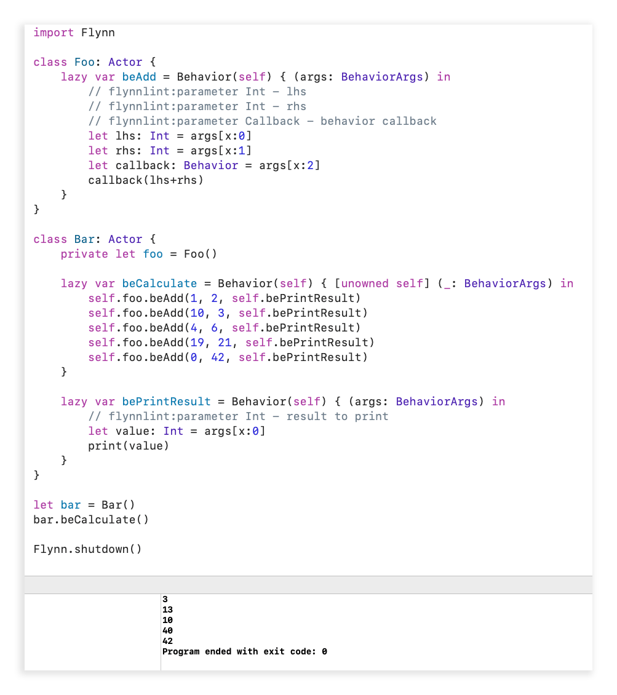

## Behaviors

Behaviors are asynchronous method calls for Actors. For 100% safe concurrency, behaviors should be the only mechanism for interacting with an Actor or an Actor's internal state.

The design direction for behaviors favors their ease of use at the call site, shifting any burden involved withe behaviors to the Actor side.


## Flynnlint Shortcut

If you are using Flynnlint, you can autocomplete a behavior by using the following shortcut:

```printString::BEHAVIOR```

Type that into any Swift file in your XCode project; save and build. When Flynnlint checks the file, it will replace the shortcut with an behavior template, like this one:

```swift
lazy var bePrintString = Behavior(self) { [unowned self] (args: BehaviorArgs) in
    // flynnlint:parameter String - string to print
    let value: String = args[x:0]
    print(value)
}
```

## Deconstructing a Behavior

Let's deconstruct the ```bePrintString()``` example behavior above so we know what is going on.

Firstly, behaviors make heavy use of the ```@dynamicCallable``` feature introduced in Siwft 4.2. Hence:

```swift
lazy var bePrintString = Behavior(self)
```

A behavior is a Swift class which contains a closure and a reference to the behavior's actor. By utilizing the lazy keyword, we can easily supply the actor to the Behavior at initialization. If using the lazy feature is not possible (behaviors in protocols, for example), you must supply to the actor to the behavior prior to actually calling the behavior.

**Important Note: Flynn follows the "let it crash" pattern. If you don't supply an actor to a behavior, or if you send a behavior parameter which doesn't match the type the receiver is expecting, expect it to crash.**

```swift
{ [unowned self] (args: BehaviorArgs) in
```

A behavior is basically a closure and the actor which it is supposed to run on. Due to the ```@dynamicCallable``` feature, when our behavior is called we receive the arguments to the call as an array. This is the ```BehaviorArgs``` type, which is alias'd to ```[Any?]```.  It is important to note a few things:

1. ```@dynamicCallable``` does not support type safety itself (all arguments  of the array must be the same type). We alleviate this burden with FlynnLint and enforcing documentation, as we'll discuss next.``
2. To avoid strong reference cycles, FlynnLint will throw a warning if your behavior does not use weak/unowned but references self. Note that you can simply use unowned self here without fear, Flynn guarantees that self is valid during behavior execution.

```swift
// flynnlint:parameter String - string to print
```

As mentioned above (1), since we use ```@dynamicCallable``` we lose the normal type safety one expects when calling a Swift function.  FlynnLint will help alleviate this burden in the following ways:

1. FlynnLint enforces that you document the parameters to a behavior using the above comment.
2. FlynnLint will sanity check the number of arguments you pass to a behavior and ensure it matches the number of arguments you have documentation for the behavior
3. FlynnLint will perform *simple* type checking. For example, if you send a string literal it will know whether the behavior is expecting a string in that position. This feature is extremely limited, but it literally better than nothing.

At this point we are inside the executable portion of our behavior. Flynn guarantees that the behavior's closure will be run concurrently safe to other behaviors on the actor, so inside of this code block you typically don't need to worry about any race or data conditions.  There are a few caveats here as well:

1. FlynnLint cannot protect you from pass-by-reference values. If you share a pass-by-reference value between Actors or outside of the Actor, Flynn cannot guarantee that two threads do not access said value at the same time. 
2. If you utilize dispatch queues or other multi-threaded APIs inside of an Actor, Flynn cannot protect you against concurrent access to an Actor's internal state. Flynn cannot protect you if you intentionally subvert your own thread safety.

```swift
let value: String = args[x:0]
```

As mentioned above, BehaviorArgs is essentially a ```[Any?]```. Behavior arguments need to be coerced to their expected value. You can do this yourself, or you can make use of the ```args[x:0]```, which is genericized to convert args[0] to the inferred type (in this case, String). If coercion fails, Flynn will let it crash.


## ChainableBehavior

A ChainableBehavior is just like a normal Behavior, except it allows chaining behavior calls together as it returns an instance to the Actor.  ```MyActor.bePrintString("hello").bePrintString(" ").bePrintString("world")``` will print ```hello world``` as expected.

## Interactions of Actor, Behavior and Scheduler

When a behavior is called an "actor message" is created and stored in an Actor's "message queue".  The actor message contains references to the behavior's closure, the actor, and the arguments to pass to the closure. If the actor's queue was empty, then the actor is scheduled to be executed.  When the actor executes, it processes actor's waiting messages.  It will process up to ```unsafeMessageBatchSize``` messages (defaults to 1000) or end early if the behavior calls ```unsafeYield()```.  If there are more messages left in the actor's queue when it finished its run, it will be rescheduled to run again sometime in the future.

**Note: Actor's have an unlimited message queue size!**

This interaction is important to note in terms of architecting your network of actors. Let's say you have an actor which reads data from a very large file in small sized chunks. You send each chunk to a processing actor. The code the processing actor runs is quite slow, at least compared to the file reading actor. If left unchecked, the reading actor will likely read in the entire file and send all chunks to the processing actor before it has a chance to process many of them. This means the entire file is now in memory, in small sized chunks, in individual messages in the processing actor's message queue.  If this behavior is undesirable, you need to code your produced such that it does not overwhelm the consumer (by using (perhaps by using a combination of ```unsafeMessagesCount``` and ```unsafeYield()``` ).

## Behaviors as Concurrency Safe Callbacks

One unique and distinct benefit of behaviors (over generic closures) is that you can use them as concurrency-safe callbacks.

Take this as an example of typical closure usage ([snarfed from here](https://cocoacasts.com/fm-3-download-an-image-from-a-url-in-swift)):

```swift
let url = URL(string: "https://cdn.cocoacasts.com/cc00ceb0c6bff0d536f25454d50223875d5c79f1/above-the-clouds.jpg")!
let dataTask = URLSession.shared.dataTask(with: url) { [weak self] (data, _, _) in
    if let data = data {
        self?.imageView.image = UIImage(data: data)
    }
}
dataTask.resume()
```

As you may have guessed, this code is not safe. **What thread will the closure be executed on?**  No one knows, it could be run anywhere. As such, closures used as callbacks in swift are **inherently concurrently UNSAFE**.

In contrast to the above, behaviors are **inherently concurrently SAFE**.  You can pass a behavior to anywhere, and that behavior is still guaranteed to execute safely on its Actor.


