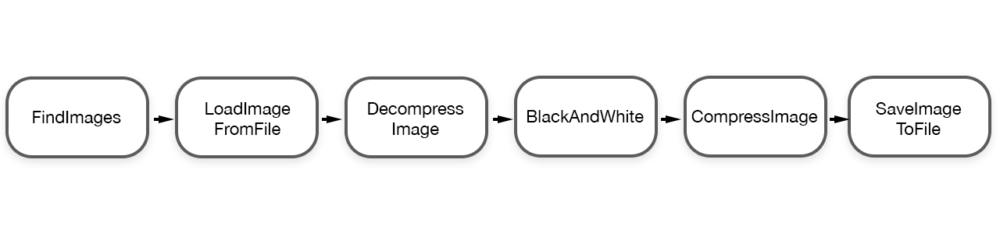

## Flowable Actors

Flowbale is a protocol for Actors included in Flynn. It defines a standard notation for chaining "arbitrary" actors together into simple networks of actors. This is extremely useful for data processing pipelines or node graphs of actors.

For example, lets suppose we were making a fully concurrent image processing pipeline. We create the following actors:

1. FindImages - finds all images in directory and sub-directories
1. LoadImageFromFile - reads an image (compressed) from disk
2. SaveImageToFile - saves an image (compressed) from disk
2. DecompressImage - takes compressed image data and decompresses it to RGB
2. CompressImage - takes image data and compresses it
3. BlackAndWhite - converts image data from RGB to Greyscale
4. GaussianBlur - performs a Gaussian blur on image data
5. Resize - resizes the image data
6. etc ...

Each actor adheres to the ```Flowable``` protocol. For this example, let's look at what the FindImages actor might look like:

```swift
class FindImages: Actor, Flowable {
    // input: path to source directory
    // output: paths to an individual image files
    public var safeFlowable = FlowableState()
    private let extensions: [String]

    init (_ extensions: [String]) {
        self.extensions = extensions
    }

    private func _beFlow(_ args: FlowableArgs) {
        if args.isEmpty { return self.safeFlowToNextTarget(args) }

        let path: String = args[x:0]
        do {
            let resourceKeys: [URLResourceKey] = [.creationDateKey, .isDirectoryKey]
            let enumerator = FileManager.default.enumerator(at: URL(fileURLWithPath: path),
                                                            includingPropertiesForKeys: resourceKeys,
                                                            options: [.skipsHiddenFiles],
                                                            errorHandler: { (url, error) -> Bool in
                                                                print("directoryEnumerator error at \(url): ", error)
                                                                return true
            })!

            for case let fileURL as URL in enumerator {
                let resourceValues = try fileURL.resourceValues(forKeys: Set(resourceKeys))
                let pathExtension = (fileURL.path as NSString).pathExtension
                if self.extensions.contains(pathExtension) && resourceValues.isDirectory == false {
                    self.safeFlowToNextTarget([fileURL.path])
                }
            }
        } catch {
            print(error)
        }
    }
}
```

A flowable actor really only needs to define on behavior, the ```beFlow()``` behavior.  This behavior receives data (in the form of the BehaviorArgs, which is [Any?]) and then passes data on to the next flowable target ( by calling ```self.safeFlowToNextTarget([fileURL.path])``` ). In our case, the FindImages actor expects to receive a file path to the directory to search for images, and for each image it finds it sends the path to that specific image to the next flowable actor.

Given this architecture and each of our actors implemented, we can then chain them together to form a pipeline where each piece of the pipeline processes concurrently to the other.



This simple pipeline can then be instantiated and called like this:

```swift
let pipeline = FindImages(["png", "jpg", "pict"]) |>
                LoadImageFromFile() |>
                DecompressImage() |>
                BlackAndWhite() |>
                CompressImage() |>
                SaveImageToFile()

pipeline.beFlow(["path/to/images/folder1/"])
pipeline.beFlow(["path/to/images/folder2/"])
```

## How Flynnlint Uses Flowable Actors

As a more complex example, we can look at how FlynnLint utilized Flowable actors. As a reminder, FlynnLint looks at all of the Swift files in a directory structure and checks them against number of rules looking for file which violate best practices with Flynn.  It's processing pipeline looks like this:


```swift
pipeline = FindFiles(["swift"]) |>
            AutoCorrectFile() |>
            Array(count: poolSize) { ParseFile() } |>
            BuildCombinedAST() |>
            Array(count: poolSize) { CheckRules(ruleset) } |>
            PrintError { (numErrors: Int) in
                self.numErrors += numErrors
            }
```

FlynnLint introduces actor pools to the concept of Flowable. After a file is autocorrected, the path to that file is distributed amongst a pool of ParseFile actors.  A single file is sent to a single ParseFile actor; the next file path is sent to another actor in the pool. As such, we can take advantage of many cores by having many actors in a particular actor pool.

**FindFiles** - walks the target directories looking for files ending in ".swift", flows the file path  
**AutoCorrectFile** - checks to see if the file contains ``::BEHAVIOR`` or ``::ACTOR`` and replaces with templates, flows the file path  
**ParseFile** - uses SourceKitten to parse the Swift file into syntax structures, flows a ``FileSyntax`` with this info  
**BuildCombinedAST** - combines all ``FileSyntax`` together into an ``AST``, which represents the syntax structure of all files in the program; flows individual files + combined AST  
**CheckRules** - Checks the file against the entire ruleset, using file structure and combined AST, flows any errors found  
**PrintError** - Prints the errors to the console, in format appropriate for Xcode error/warning display


This network of actors not only makes the code more modular, the practice performance benefits are real and immediate.  FlynnLint includes some unit tests which benchmarks it against a well-known linter against a corpus of Swift files. As of this writing, FlynnLint lints the corpus about 2x faster (apples-to-oranges comparison, but better than nothing).