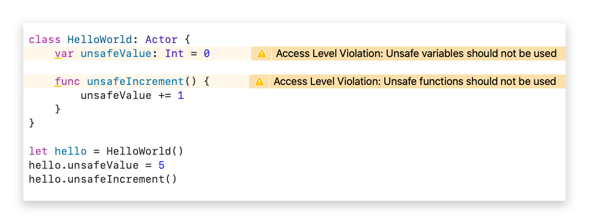

# FLYNNLINT

As mentioned elsewhere, Flynn really works best when combined with FlynnLint. It will protect you, at compile time, from programming practices which undermine the safety provided by the Actor-Model paradigm.  This section attempts to list all of the checks FlynnLint performs for you.  It may not be up-to-date, [as such you can go straight to the source if needed](https://github.com/KittyMac/flynnlint)

# Warnings

## Use closures for Behaviors, do not use not private functions directly
It may be tempting to send a private function as the closure for a Behavior. It results in cleaer code which doesn't require calling ```self.``` inside of the behavior. However, Swift generates a closure with a strong reference to self when you pass the function to the Behavior, creating a strong retain cycle between the actor and its behaviors.


## Use weak/unowned self with self referencing Behaviors
When you create a behavior which needs to access ```self```, then the closure should be flagged as weak or unowned for self. Otherwise, a strong retain cycle between the Actor and the Behavior will prevent the Actor from being deallocated.


## Prefer not to use unsafe variables or functions
Using the "unsafe" feature of FlynnLint allows you to open **unsafe concurrent** access to the internal of an Actor. While this is sometimes unavoidable, it can often be avoided by using behaviors. However, if it is truly unavoidable, then all you will is a warning from FlynnLint at the definition site to remind you that perhaps there is a better way or that you need to ensure that the access is safe.



## Simple type checking for behavior arguments
Unfortunately SourceKit does not provide the level of information necessary for FlynnLint to do full type checking for behaviors arguments. Be that as it may, FlynnLint does what it can based on the behavior documentation you provide.


# Errors

## Missing behavior argument documentation
If your behavior accepts arguments, then you **must** provide documentation for those arguments. As behavior calls are not type-checked by the Swift compiler, FlynnLint does what it can to help. But it can't help if it doesn't know what arguments your behavior is expecting.


## Malformed behavior argument documentation
Documentation for behavior arguments must adhere to the correct formatting for FlynnLint to properly parse.


## Incorrect number of arguments to behavior
Once proper behavior documentation is supplied, FlynnLint can help protect you from accidentally calling a behavior wrong. One such check is ensuring that the number of arguments supplied matches the number of arguments documented.


## Accessing undocument behavior argument
If you attempt to access a behavior argument which is outside the scope of your documented arguments, FlynnLint will provide you with an error. **Note that this is only enforced when you use the ```arg[x:0]``` syntax**


## Behavior naming convention violation
FlynnLint enforces a naming convention for all behaviors. Since behaviors look just like normal function calls yet act very differently, it is useful if all behaviors are visibly different to let you know they are behaviors. The current naming convention is that behaviors must start with **be**.


## Variables and functions must be private
Concurrency in Flynn is only as safe as non-safe access is restricted to the internals of Actors. As such, all variables and functions for an Actor must be labelled private. The only exceptions to this rule are if the variable or function is prefixed with "safe" or "unsafe".


## Safe variable and function access limited to Actor subclasses
A subclass of an Actor should have direct access to the internal of the actor's superclass. However, Swift's built-in access control scheme does not provide a "protected" access. Since we want "protected" access, FlynnLint provides this through the use of the "safe" prefix. Safe variables and functions are accessible from subclasses of the Actor, but not accessible from outside of the actor hierarchy.


