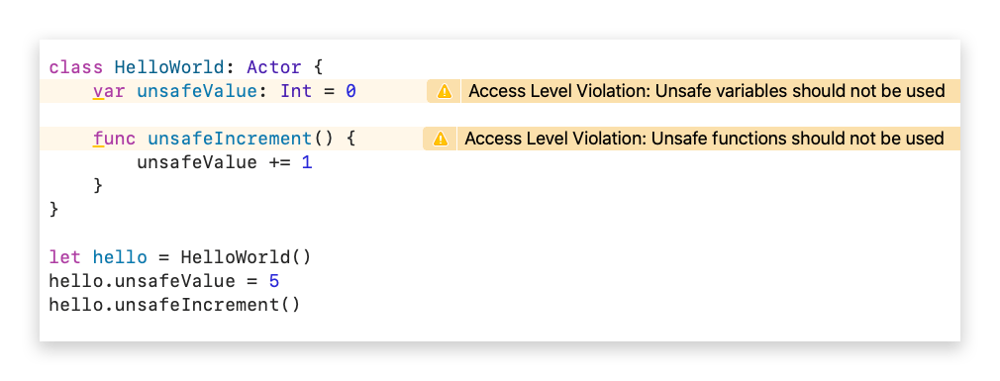
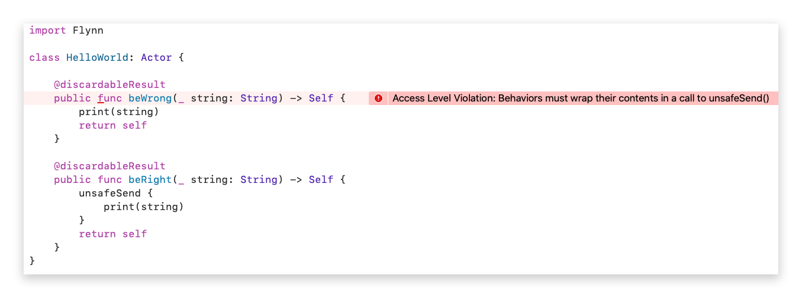
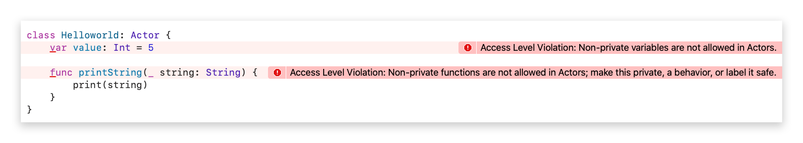
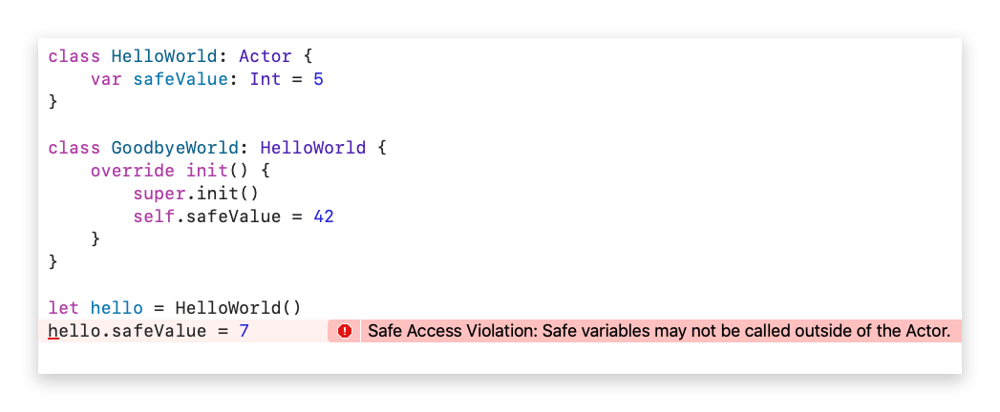

# FLYNNPLUGIN

The FlynnPlugin will protect you, at compile time, from programming practices which undermine the safety provided by the Actor-Model paradigm.  This section attempts to list all of the checks FlynnPlugin performs for you.

# Warnings

## Prefer not to use unsafe variables or functions
Using the "unsafe" feature of FlynnPlugin allows you to open **unsafe concurrent** access to the internal of an Actor. While this is sometimes unavoidable, it can often be avoided by using behaviors. However, if it is truly unavoidable, then a warning from FlynnPlugin at the definition site will remind you that perhaps there is a better way or that you need to ensure that the access is safe.

# Errors

## Behaviors must be wrapped with a call to unsafeSend()
If you use FlynnPlugin's autogenerated external behaviors you won't need to worry about this error. However, it is possible for you to write your own external behaviors directly.  In such as case, the contents of your behavior must be wrapped in the call to unsafeSend() to ensure it is execute safely on the actor.

## Variables and functions must be private
Concurrency in Flynn is only as safe as non-safe access is restricted to the internals of Actors. As such, all variables and functions for an Actor must be labelled private. The only exceptions to this rule are if the variable or function is prefixed with "safe" or "unsafe".

## Safe variable and function access limited to Actor subclasses
A subclass of an Actor should have direct access to the internal of the actor's superclass. However, Swift's built-in access control scheme does not provide a "protected" access. Since we want "protected" access, FlynnPlugin provides this through the use of the "safe" prefix. Safe variables and functions are accessible from subclasses of the Actor, but not accessible from outside of the actor hierarchy.

