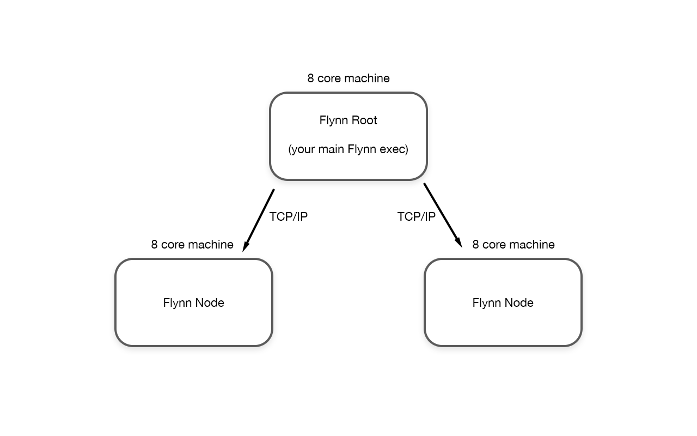
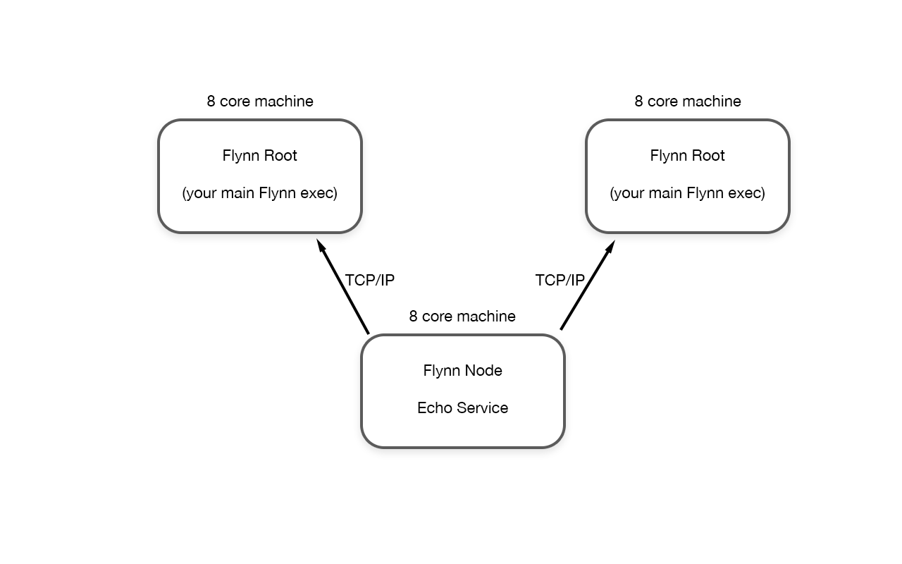

# RemoteActors

As of v0.2 Flynn has a new kind of actor, the ```RemoteActor```.  RemoteActors behave similarly to Actors; they have internal state which is concurrency safe and you interact with them by calling behaviors. RemoteActors are intended to execute outside of your normal Flynn environment, usually that's in another process running on an different machine.  Since RemoteActors run elsewhere, they are more restrictive then normal Actors (for instance, you cannot choose to unsafely expose access RemoteActors).

## Node <- Root -> Node architecture

Flynn provides the basic building blocks for you to create a number of clustering architectures.  For the purposes of this discussion, lets take a look at a simple **Node<-Root->Node** architecture.



**Flynn Root** is what you would think of as your traditional Flynn-based program. You might have existing Actors which run concurrently in that process, executing the 8 cores available on the machine it is running on. Your normal Actors are light-weight and highly performant, so you can rely on them to have a low-latency turn around for tasks which require that.

However, during the course of your development you encounter some tasks which are heavier in nature. Perhaps they require more processing time to complete their operation. It would be nice if these tasks to be offloaded to a different machine, allowing your Flynn root to handle the low-latency tasks and not get bogged down running the heavier stuff.

So you create a couple of **Flynn Nodes**, each running on a new 8 core machine.  The nodes connect to the root, allowing any RemoteActors created in the root program to actually be created on one of the nodes.  Behavior calls to the remote actor in root are forwarded over the network to execute on the remote actor on the node.  Root now has access to 2x the number of cores than it did previous for these heavy tasks (8 cores if run locally as actors, 16 cores if run remotely).  If this needs to be expanded in the future, more nodes can be created and made available to the root.

For everything to function properly, the root and the nodes should be the same built executable.  Let's say we have a RemoteActor called ```Echo```.  Both sides need to have the same definition of what ```Echo``` is.  As such, it is easiest to have your root and nodes be the same built executable.  When initialized, the root should initialize as root and the node should initialize as a node.

To have your executable act as a root, simply add the following code during the initialization of your program:

```swift
Flynn.Root.listen("127.0.0.1", 9999, [])
```

The first argument is the IP address the root should listen on for connecting nodes, the second is the TCP port. The final argument is a list of RemoteActor types which root allows nodes to create (useful for **Root<-Node->Root** architecture, see below).

To have your executable act as a node, simply add the following code during the initialization of your program:

```swift
Flynn.Node.connect("127.0.0.1", port, [Echo.self])
```

The first argument is the IP address of the root this node should connect to, the second is the TCP port. The final argument is a list of RemoteActor types which this node supports being run on itself. In our example, it means that the root will be able to instantiate remote actors of type ```Echo```, and this node will be able to create and run those.


## Root <- Node -> Root architecture

While the above architecture is useful for providing more raw processing power to the root program by connecting nodes to it, it only works well when the root can initialize and push remote actors down to the nodes.

Consider instead the **Root<-Node->Root** architecture:



In this scenario, we want to provide a single, shared service to multiple roots. Perhaps this is a global chat room available to multiple load balanced http servers; no matter which http server the client is balanced to, we want them to be able to particiapte in the global conversation. In this case, the "chat room service" resides on the node, and when the node connects to a root it lets the root know what pre-existing RemoteActors are running on the node.  Code running on the root can then gain access to a RemoteActor which is paired to this service running on the node, thus both roots can access the same chat room service.

In this scenario, your node initialization code might look like this:

```swift
let echoServiceName = "SHARED ECHO SERVICE"
Flynn.Node.connect("127.0.0.1", port, [Echo.self])
Flynn.Node.registerActorsWithRoot([Echo(echoServiceName)])
```

On the root, you might gain access to the remote service like this:

```swift

Flynn.Root.listen("127.0.0.1", port, [Echo.self])

// At some point in future when you need the service:

let echoServiceName = "SHARED ECHO SERVICE"
Flynn.Root.remoteActorByUUID(echoServiceName, Flynn.any) {
    if let echoService = $0 as? Echo {
        echoService.bePrint("Hello World")
    } else {
        // no echo service is currently available
    }
}

```